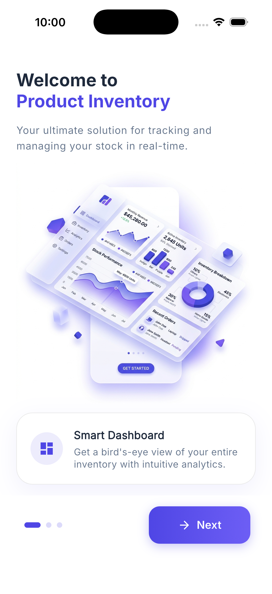
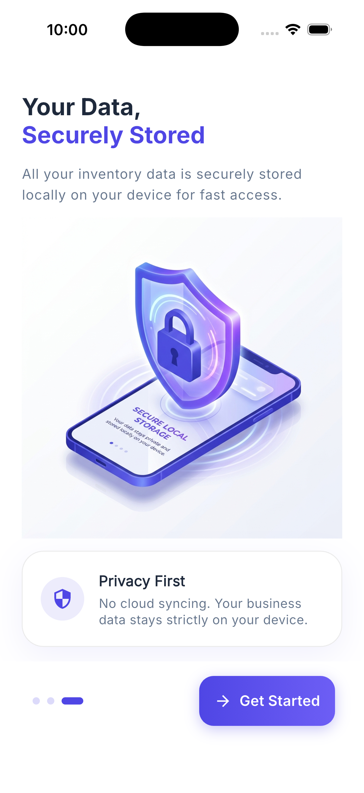
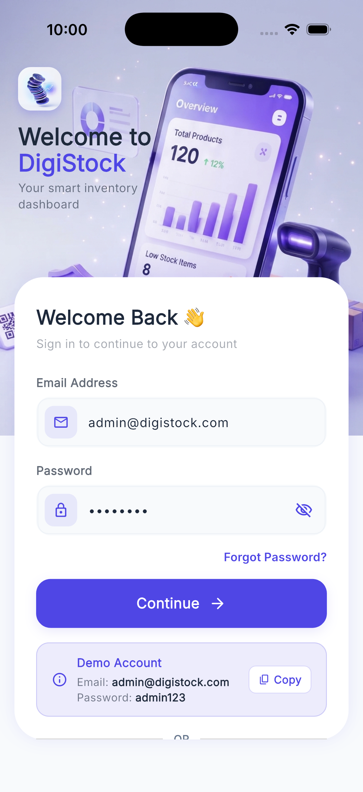
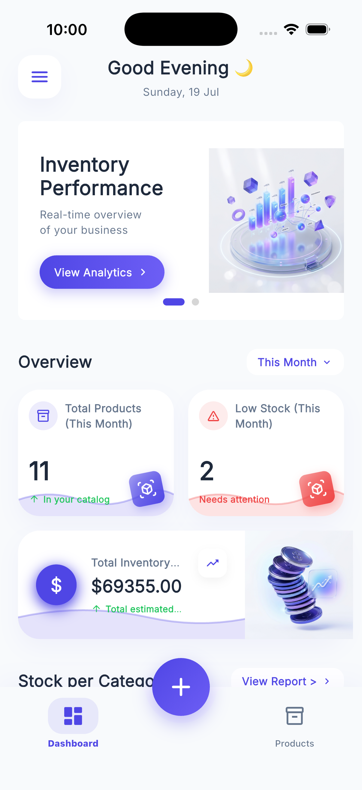
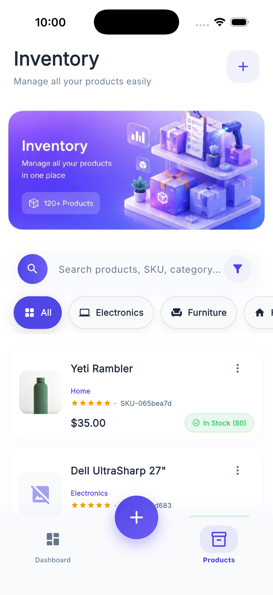
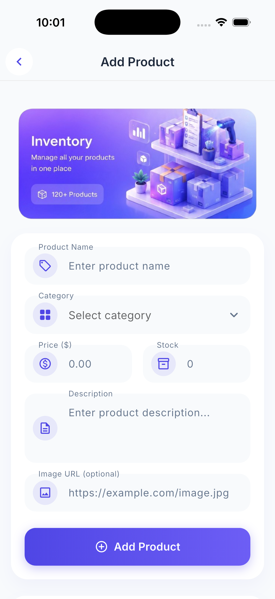
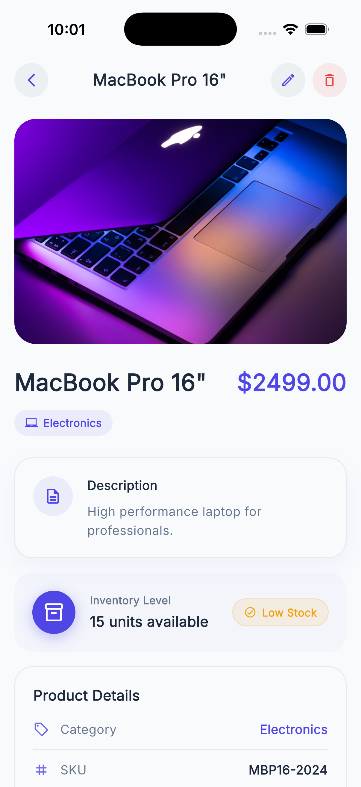

# DigiStock - Product Inventory Dashboard

DigiStock is a premium Flutter inventory management app for tracking products, stock levels, and inventory value from a clean mobile dashboard. It uses local storage, seeded demo data, BLoC state management, and a feature-first Clean Architecture structure.

The app includes onboarding, a demo login flow, dashboard analytics, searchable product lists, product details, and add/edit/delete inventory actions.

## App Screenshots

Screenshots are stored in [`app_screenshot/`](app_screenshot/) so reviewers can quickly understand the user flow.

<table>
  <tr>
    <td align="center"><strong>Onboarding</strong><br></td>
    <td align="center"><strong>Onboarding Details</strong><br></td>
    <td align="center"><strong>Login</strong><br></td>
  </tr>
  <tr>
    <td align="center"><strong>Dashboard</strong><br></td>
    <td align="center"><strong>Product List</strong><br></td>
    <td align="center"><strong>Add Product</strong><br></td>
  </tr>
  <tr>
    <td align="center"><strong>Product Details</strong><br></td>
  </tr>
</table>

## Features

- **Onboarding flow**: Three-screen introduction for dashboard analytics, stock management, and local data storage.
- **Demo login**: Login page with a pre-filled demo account: `admin@digistock.com` / `admin123`.
- **Dashboard analytics**: KPI cards for total products, total inventory value, and low-stock items.
- **Category stock chart**: Visual stock breakdown by product category using `fl_chart`.
- **Product catalog**: Paginated product list with pull-to-refresh and skeleton loading states.
- **Search and filters**: Debounced search, category chips, low-stock filter, and price/name sorting.
- **Product details**: Product image, description, category, SKU, barcode, added date, stock status, edit, and delete actions.
- **Add and edit products**: Validated form for name, category, price, stock, description, and optional image URL.
- **Local persistence**: Products are stored in Hive and sessions/onboarding state are stored locally.
- **Premium UI system**: Shared buttons, cards, icon buttons, empty states, network image fallback, animations, and custom theme.
- **Multi-flavor entry points**: Separate development, staging, and production main files.

## Tech Stack

- **Flutter** and **Dart**
- **flutter_bloc** for state management
- **go_router** for navigation and route guards
- **Hive** and **hive_flutter** for local product storage
- **shared_preferences** for session and onboarding flags
- **fl_chart** for dashboard charts
- **flutter_animate** for UI motion
- **google_fonts** for typography
- **uuid** for product, SKU, and barcode generation

## Architecture

The project follows a feature-first Clean Architecture approach.

- **Data layer**: Hive models, local data sources, and repository implementations.
- **Domain layer**: Entities, repository contracts, and use cases.
- **Presentation layer**: Pages, widgets, BLoCs, events, and states.
- **Core layer**: Router, theme, shared widgets, utilities, and error handling.

## Folder Structure

```text
product_inventory/
├── android/                         # Android native project files
├── ios/                             # iOS native project files
├── app_screenshot/                  # README and review screenshots
│   ├── add_product.png
│   ├── dashboard.png
│   ├── login.png
│   ├── onboarding1.png
│   ├── onboarding2.png
│   ├── product_details.png
│   └── productlist.png
├── assets/
│   ├── images/                      # App logo, onboarding art, banners, and UI images
│   └── readme/                      # README screenshot/debug helper output
├── config/                          # Environment JSON files
│   ├── dev.json
│   ├── ngrok.json
│   ├── prod.json
│   └── stg.json
├── docs/                            # Architecture, testing, UI, and security documentation
├── lib/
│   ├── app.dart                     # Root MaterialApp, providers, theme, and router
│   ├── bootstrap.dart               # Hive setup, seed data, repositories, and app bootstrap
│   ├── main_development.dart        # Development entry point
│   ├── main_staging.dart            # Staging entry point
│   ├── main_production.dart         # Production entry point
│   ├── core/
│   │   ├── error/                   # Failure and exception classes
│   │   ├── router/                  # go_router setup and route protection
│   │   ├── theme/                   # App colors, typography, and ThemeData
│   │   ├── utils/                   # Either type and snackbar helpers
│   │   └── widgets/                 # Shared reusable UI components
│   └── features/
│       ├── auth/
│       │   ├── data/                # Local auth session data source and repository
│       │   ├── domain/              # User entity, auth repository contract, use cases
│       │   └── presentation/        # Login page and AuthBloc
│       ├── inventory/
│       │   ├── data/                # Hive product model, data source, repository
│       │   ├── domain/              # Product entity, repository contract, use cases
│       │   └── presentation/        # Dashboard, list, details, form pages, BLoCs, widgets
│       └── onboarding/
│           └── presentation/        # Onboarding screens
├── scripts/                         # Build, run, flavor, and deployment helper scripts
├── test/                            # Widget tests and README screenshot helper test
├── web/                             # Flutter web shell and icons
├── pubspec.yaml                     # Dependencies, assets, and Flutter configuration
└── AI_WORKFLOW_REPORT.md            # AI workflow and implementation report
```

## Getting Started

### Prerequisites

- Flutter SDK installed
- Dart SDK compatible with `sdk: ^3.11.5`
- Android Studio/Xcode setup for mobile builds

### Install Dependencies

```bash
flutter pub get
```

### Run the App

Development:

```bash
flutter run -t lib/main_development.dart
```

Staging:

```bash
flutter run -t lib/main_staging.dart
```

Production:

```bash
flutter run -t lib/main_production.dart
```

## Testing and Quality

Run tests:

```bash
flutter test
```

Run static analysis:

```bash
flutter analyze
```

Format code:

```bash
dart format lib test
```

## Documentation

Additional project notes are available in [`docs/`](docs/):

- [`frontend-architecture.md`](docs/frontend-architecture.md)
- [`component-standards.md`](docs/component-standards.md)
- [`ui-guidelines.md`](docs/ui-guidelines.md)
- [`frontend-security.md`](docs/frontend-security.md)
- [`frontend-testing.md`](docs/frontend-testing.md)

For the AI-assisted build process, see [`AI_WORKFLOW_REPORT.md`](AI_WORKFLOW_REPORT.md).
